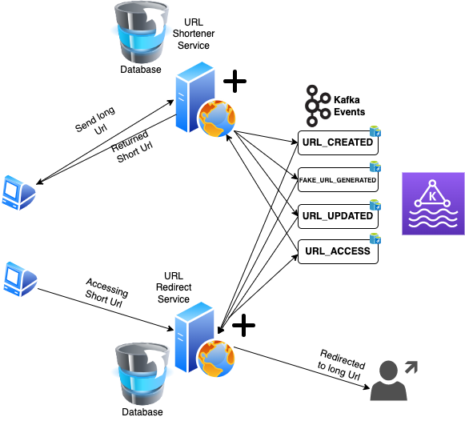

## **Introduction**
This web app is a url shortening application, a user needs to register and login before URL shortening 
can be performed. A user put in a supposedly long URL and short one will be generated by the application
that will redirect to the long URL.

It keeps track of each url uploaded for reference sake.

There are five folders in this repo

#### **Client**
The client folder contains client side angular app written in latest Angular 15

#### **Url-management-service**
This folder contains Java Spring Microservice application that handles authentication and url data management

#### **Url-redirect-service**
This folder contains Java Spring Microservice application that handles redirection of generated 
url to the original url

#### **Event-bus**
This folder contains Docker resources for bootstraping Kafka that we use to handle service to service
communication. The architecture is event driven and event broker like Kafka is needed to build the whole
communication frameworks.

#### **Infra**
This folder contains Kubernetes resource for provisioning of the infrastructures in easy to scale manner.

The diagram below shows how architecture procedure of the whole application.

## **How to run**
There two ways to run this application, scalable and non scalable way

#### **Non Scalable Way**
1. Start client app [required applications; node, npm]
    * cd into client folder
    * run `npm i` to install npm dependencies
    * run `npm install -g @angular/cli` 
    * run `ng serve` this will start application on port `4200`
    
 2. Start event bus, from the root folder [required applications; docker, docker-compose]
    * cd into event-bus folder
    * run `docker-compose up`
    
 3. Start url-management-service, from the root folder [required applications; Java SDK]
    * cd into url-management-service folder
    * run `./mvnw spring-boot:run`
 
 4. Start url-redirect-service, from the root folder [required applications; Java SDK]
     * cd into url-redirect-service folder
     * run `./mvnw spring-boot:run`
 
 Hurray!!!
 
 #### **Non Scalable Way**
This setup requires docker, skaffold and kubernetes on your machine, this way give opportunity
to scale each service up down according to number of nodes available and number of replicas 
we need to deploy. 
1. Create `irembo-url-shortener.com` in your computer host file, point it to `127.0.0.1`
2. Create `irembo-url-redirect.com` in your computer host file, also point it to `127.0.0.1`
3. From the root folder run `skaffold dev`
